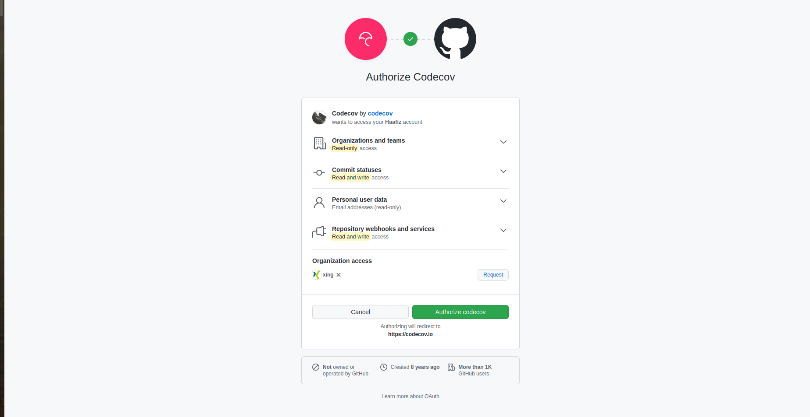
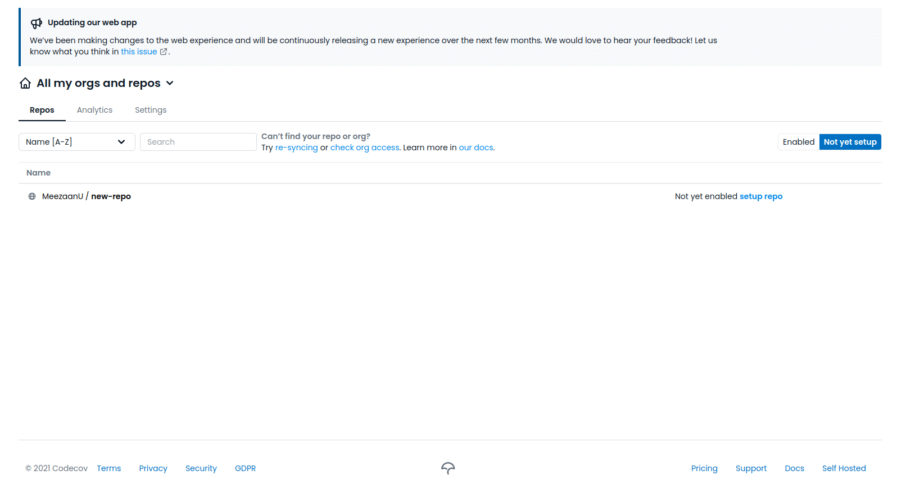
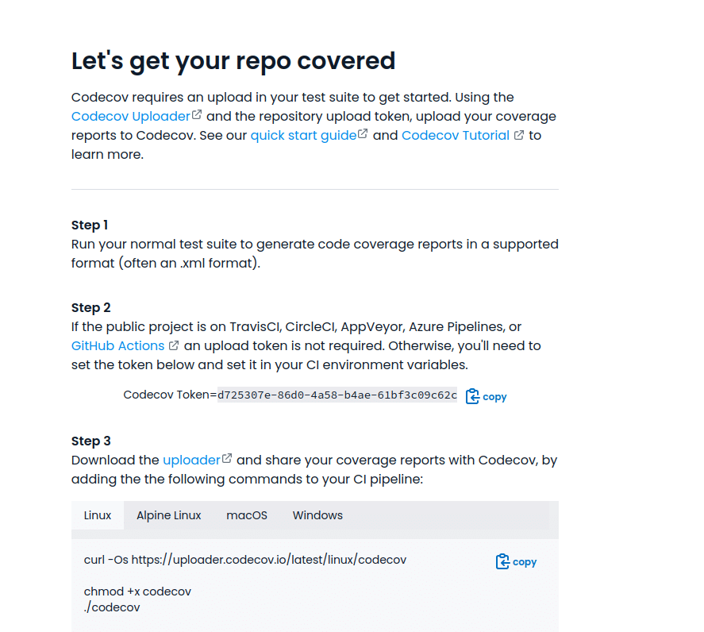
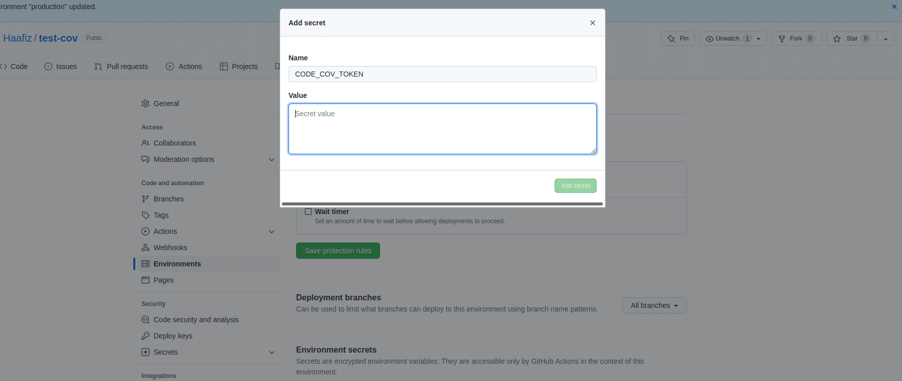
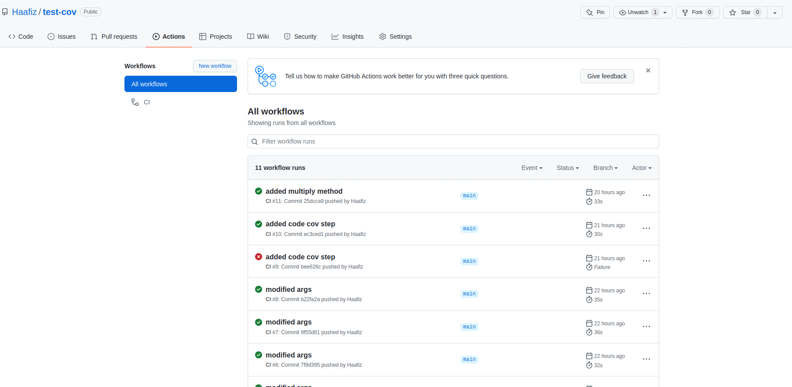
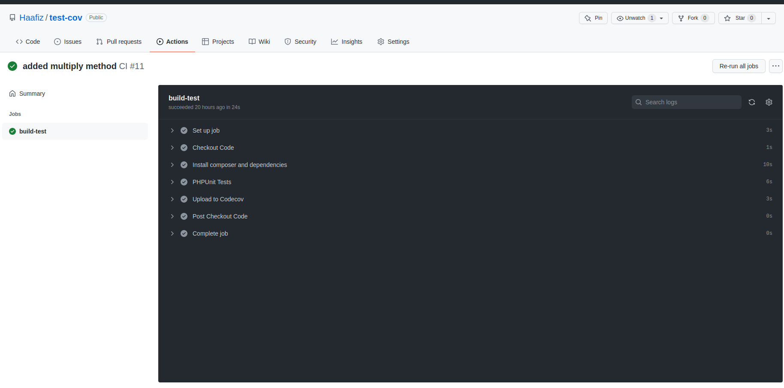
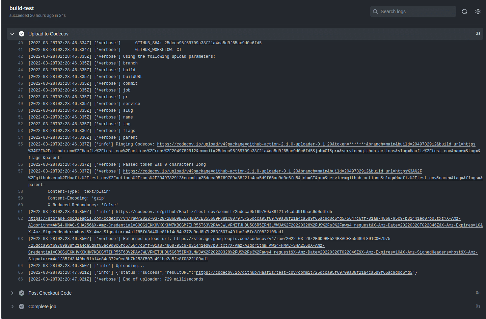

# GITHUB ACTION (play ground)
https://docs.github.com/en/actions/using-workflows/workflow-syntax-for-github-actions

Measuring PHP Code Coverage with PHPUnit and GitHub Actions
```html
+-- composer.json
+-- composer.lock
+-- src
|   +-- URL.php
+-- tests
|   +-- URLTest.php
+-- phpunit.xml
```
In order to acquire the token, you’ll need to access the Codecov [login page](https://about.codecov.io/sign-up/) and choose the option to sign in with GitHub. Codecov will then request access:\

  

Once you are logged in and have given GitHub access to Codecov, go to Repos > Not yet setup.

  

Click the target repository’s name to view some outlined steps:

  

Copy the **Codecov Token** and add it in your **ci.yml** file, or even better, in your GitHub repository environment’s secret token by going to **Settings > Secrets > Actions**. The benefit of doing it this way is that your token will be automatically encrypted.

  

Now you can go ahead and push your changes to the main branch in the GitHub repo. Once they’re pushed, the actions you’ve set up will run. You can view them on GitHub under your repository’s Actions tab:

  

Try opening one of the workflow runs and then select build-test. You will see all of the executed actions, along with their execution time:

  

To explore further, you can select Upload to Codecov and get the resulting URL from line 65, as pictured here:

  

Access that URL to see the code coverage report based on your last commit. Based on the example above, this was a multiply function:

